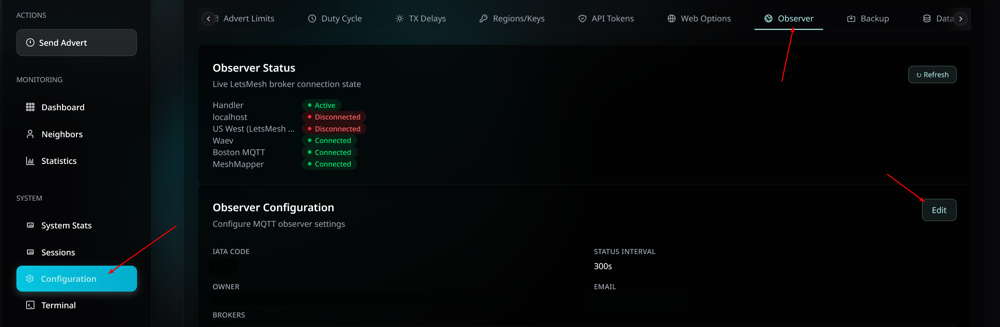
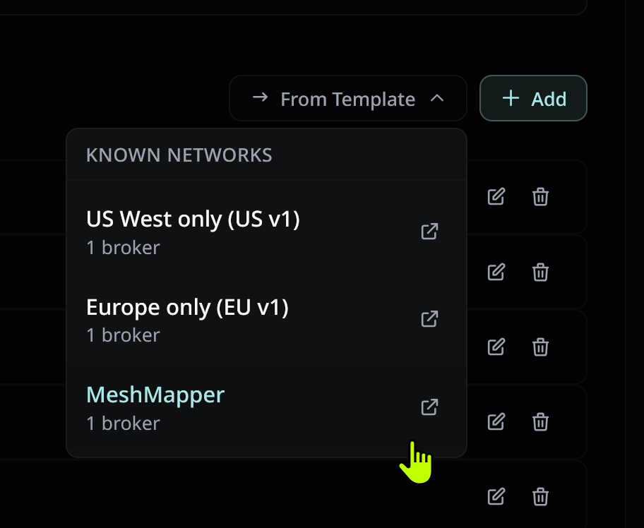
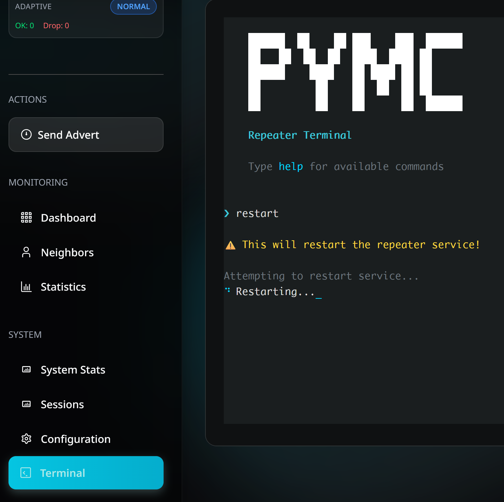

# PyMC Repeater MQTT Setup

These instructions cover adding the MeshMapper MQTT broker to an existing pyMC-Repeater installation. If you haven't set up pyMC-Repeater yet, refer to the [pyMC documentation](https://github.com/rightup/pyMC_Repeater) first.

*Thanks to mrzarquon and yellowcooln for providing the information for this guide.*

## Prerequisites

  - A Raspberry Pi running pyMC-Repeater with LetsMesh already configured and working

## Adding the MeshMapper Broker

### Option 1. Add MeshMapper from the UI

This is the easiest way to add MeshMapper to an existing pyMC-Repeater installation.

1. Open **Configuration > Observer**.
2. Click **Edit** next to **Observer Configuration**.



3. Click **From Template**.
4. Select **MeshMapper**.



5. Click **Save Settings**.
6. Open the **Terminal** option on the left.
7. Enter `restart` to restart the service.



### Option 2. Add MeshMapper manually

If you prefer, you can still add MeshMapper by editing the config file directly.

#### 1. Stop the Service

```bash
sudo systemctl stop pymc-repeater
```

#### 2. Edit the Configuration

Open the pyMC-Repeater config file:

```bash
sudo nano /etc/pymc_repeater/config.yaml
```

Add `mqtt.meshmapper.cc` to the `additional_brokers` field under the `letsmesh` section:

```yaml
letsmesh:
  enabled: true
  iata_code: YOW  # Replace with your region's IATA code
  broker_index: 0
  additional_brokers:
  - name: mqtt.meshmapper.cc
    host: mqtt.meshmapper.cc
    port: 443
    audience: mqtt.meshmapper.cc
  status_interval: 300
```

If you don't want to send logs to LetsMesh and only want to use MeshMapper, set `broker_index` to `-2`:

```yaml
letsmesh:
  enabled: true
  iata_code: YOW  # Replace with your region's IATA code
  broker_index: -2
  additional_brokers:
  - name: mqtt.meshmapper.cc
    host: mqtt.meshmapper.cc
    port: 443
    audience: mqtt.meshmapper.cc
  status_interval: 300
```

Save and exit (`Ctrl+X`, then `Y`, then `Enter`).

#### 3. Start the Service

```bash
sudo systemctl start pymc-repeater
```

#### 4. Verify the Connection (Optional)

Follow the logs to confirm the broker connection is working:

```bash
sudo journalctl -u pymc-repeater.service -f | grep LetsMeshHandler
```

## Verifying Your Observer

Once your observer is running and connected, it will appear in your region's **Admin Portal** under the [Observers tab](admins.md#observers) once packets have been received (repeater or companion adverts, or wardriving pings). You should see a checkmark under the broker(s) your observer is connected to.
